# Skillduggery

Skillduggery is a macOS menu bar security scanner for AI Agent Skills.

It scans OpenAI and Claude skill folders for prompt injection, data exfiltration, command injection, and other high-risk patterns using a full Swift pipeline:

- Pattern-based detection (`YAML` signatures + `YARA`-derived matching)
- Behavioral Python dataflow heuristics (source/sink analysis)
- Meta analyzer for dedupe + false-positive reduction + suppression handling
- High-signal notifications with one consolidated alert per scan

This app does **not** utilize LLM providers for judging. It runs locally on your machine.

## Why Skillduggery

Agent skills are executable instructions and code. That makes them a supply-chain and runtime-risk surface.

Skillduggery is designed to give fast, actionable security signal while staying lightweight:

- Live in your menu bar, not another dashboard
- Manual scan when you want it, daily scheduled scans when you forget
- Catch-up behavior on launch/wake if a run was missed
- Focused results with suppression support for known-safe findings

## Current Feature Set

- Menu bar app with scan status:
  - `Scanning...` while active
  - Last scan timestamp while idle
- User-selected scan roots (security-scoped bookmarks)
- Manual scan action from menu and settings
- Daily schedule with missed-run catch-up on launch/wake
- Auto-launch at login
- Recent findings in menu:
  - Severity color coding (`SAFE` blue, `LOW` green, `MEDIUM` yellow, `HIGH` orange, `CRITICAL` red)
  - Per-run alert/warning counts
  - Row tap opens Settings, scrolls to Recent Findings, expands the selected run
- Settings UI with:
  - Scan roots management
  - Detection toggles (behavioral + meta analyzers)
  - Notification policy toggle (high-signal only)
  - Active suppressions management
- SQLite persistence for settings, roots, runs, findings, suppressions
- Signed rule-pack integrity verification (manifest signature + per-file SHA-256)

## Threat Coverage

Out-of-the-box rules cover:

- Prompt injection patterns (instruction override, concealment prompts)
- Command/code injection (eval/exec, shell execution sinks)
- Data exfiltration patterns (sensitive file reads, suspicious outbound patterns)
- Behavioral flows in Python:
  - Sensitive sources (env vars, credential files)
  - Tainted propagation into network/process/dynamic execution sinks

Rule IDs and categories are represented in:

- `Skillduggery/Skillduggery/Shared/SecurityModels.swift`
- `Skillduggery/Skillduggery/Scanner/RuleDefinitions.swift`

## Scanner Pipeline

```mermaid
flowchart LR
  A["Selected roots"] --> B["Skill discovery (SKILL.md)"]
  B --> C["Skill load + manifest parse"]
  C --> D["Rule pack load + signature/hash validation"]
  D --> E["Static analyzer (YAML + YARA-derived)"]
  E --> F["Behavioral analyzer (Python source/sink)"]
  F --> G["Meta analyzer (dedupe + false positive filtering + suppressions)"]
  G --> H["Persist run/findings (SQLite)"]
  H --> I["Single consolidated notification (HIGH/CRITICAL)"]
```



## Rule Packs and Integrity

Skillduggery can load a signed external rule pack from:

`~/Library/Application Support/Skillduggery/rules/current/`

Expected files:

- `manifest.json`
- `manifest.sig` (raw 64-byte Ed25519 signature or base64-encoded)
- one or more rule files listed in the manifest (`.yaml/.yml`, `.yar/.yara`)

Validation steps:

1. Verify Ed25519 signature on `manifest.json`
2. Verify SHA-256 hash of each listed rule file
3. Parse rules
4. If anything fails, automatically fall back to bundled default rules and emit an integrity finding

Implementation:

- `Skillduggery/Skillduggery/Scanner/RulePackLoader.swift`

## Privacy and Data Model

Skillduggery is local-first.

- Local scan only
- No external upload
- Notification payload is summary-level only

Persisted data (SQLite):

- `app_settings`
- `scan_roots`
- `scan_runs`
- `findings`
- `finding_suppressions`

Database location:

`~/Library/Application Support/Skillduggery/skillduggery.sqlite`

Migration behavior:

- Forward migrations via `PRAGMA user_version`
- Backup snapshot created before schema upgrades

Implementation:

- `Skillduggery/Skillduggery/Infra/Persistence/Store.swift`

## Requirements

- macOS target currently set to `26.2` in project settings
- Xcode with Swift toolchain that supports this target

## Quick Start

### 1. Open in Xcode

Open:

`Skillduggery/Skillduggery.xcodeproj`

Run scheme:

`Skillduggery`

### 2. Add scan roots

In Settings, add one or more folders containing skills, for example:

- `~/.codex/skills`
- `~/.claude/skills`

### 3. Run a manual scan

From menu bar:

- Click `Scan Agent Skills`

or from Settings:

- Click `Run Manual Scan`

### 4. Review findings

- Menu shows high-level recent findings and threat summaries
- Settings shows detailed run findings and allows 7-day suppression per finding

## Development

### Build

```bash
xcodebuild -project Skillduggery/Skillduggery.xcodeproj \
  -scheme Skillduggery \
  -configuration Debug \
  -derivedDataPath /tmp/Skillduggery-DD \
  build
```

### Test

```bash
xcodebuild -project Skillduggery/Skillduggery.xcodeproj \
  -scheme Skillduggery \
  -configuration Debug \
  -derivedDataPath /tmp/Skillduggery-DD \
  test
```

Latest local run: tests succeeded.  
Note: UI tests are intentionally skipped by default profile.

## Project Structure

```text
Skillduggery/
  Skillduggery/
    App/                # menu bar scene, app model, lifecycle
    Presentation/       # settings and findings UI
    Scanner/            # loader, analyzers, rule parsing, scan engine
    Infra/              # persistence, scheduling, notifications, login launch
    Shared/             # core security models
  SkillduggeryTests/    # scanner, rule pack, persistence, scheduling tests
  SkillduggeryUITests/  # UI test stubs (currently skipped by profile)
  docs/
    architecture/
    testing/
    brainstorms/
    plans/
```

## Supported Skill Conventions

The scanner discovers directories containing `SKILL.md`, parses frontmatter, and inspects associated files.

Primary implementation:

- `Skillduggery/Skillduggery/Scanner/SkillLoader.swift`

File typing currently recognizes:

- Markdown (`.md`, `.markdown`)
- Python (`.py`)
- Shell (`.sh`, `.bash`, `.zsh`)
- Binary and other

## Behavior Notes

- Only one scan runs at a time
- If another trigger arrives while scanning, one pending trigger is coalesced by priority:
  - `manual > catch_up > scheduled`
- Notifications can be configured as high-signal only
- Suppressions expire automatically

## Troubleshooting

- If no findings appear:
  - Verify roots were added and are still accessible
  - Trigger a manual scan
  - Check recent runs in Settings
- If scans fail with "No readable roots selected":
  - Re-add roots to refresh security-scoped bookmarks
- If a custom rule pack is ignored:
  - Confirm signature and checksums in `manifest.json`
  - Check for `RULE_PACK_INTEGRITY` findings

## License

Apache 2.0 - See [LICENSE](LICENSE) for details.
